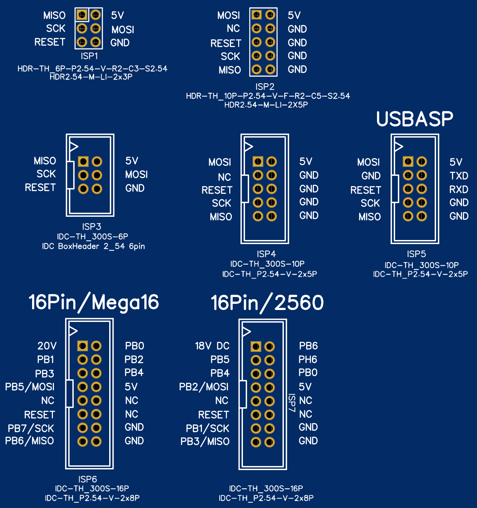

# GBM Decoder –  Programmeerhandleiding (Nederlands)

Deze handleiding helpt je stap voor stap om de **GBM decoder** te programmeren en in gebruik te nemen.
De uitleg is gericht op mensen zonder uitgebreide programmeerervaring.

---

## Benodigdheden

Voor het programmeren heb je nodig:

- Arduino IDE (op je PC of laptop)
- MightyCore (board support voor ATmega16)
- Een **Arduino as ISP** of **USBASP** programmer
- De GBM decoder print

Een programmer is nodig omdat deze decoder **geen USB-poort** heeft.

### Arduino as ISP programmer

- Achtergrond informatie: https://docs.arduino.cc/built-in-examples/arduino-isp/ArduinoISP/
- Je kan een bestaande Arduino (UNO, Nano) ombouwen tot een **Arduino as ISP**, maar je kan ze ook als kant-en-klare programmers kopen.


### USBASP programmer

- Officiële site: https://www.fischl.de/usbasp/
- Je kunt kant-en-klare USBASP programmers kopen:
  - AliExpress (goedkoop)
  - Bij diverse Nederlandse leveranciers, zoals TinyTronics:
    https://www.tinytronics.nl/nl/communicatie-en-signalen/serieel/usb/usbasp-usb-avr-programmer-met-flatcable
- Probleem: Windows kan problemen geven met de USB VID/PID van ISBasp
---

## Aansluiten van de programmer (ISP)

De programmer wordt aangesloten via de **ISP-connector** op de print.



Belangrijk:

- De afbeelding hierboven laat verschillende ISP-varianten zien
- Voor deze decoder is vooral relevant:

👉 **“16Pin / Mega16”**

Daar zie je de aansluiting zoals op de decoder gebruikt wordt.

✔ De **eerste 10 pins** zijn identiek aan die van de USBASP
✔ Daardoor kun je een standaard flatcable gebruiken

Let goed op de **oriëntatie (pin 1)** bij aansluiten!

---

## MightyCore installeren (Arduino IDE)

Omdat deze decoder een **ATmega16** gebruikt, moet je MightyCore installeren.

👉 GitHub:
https://github.com/MCUdude/MightyCore

👉 Installatie-instructies:
https://github.com/MCUdude/MightyCore?tab=readme-ov-file#how-to-install

### Korte uitleg installatie

1. Open de **Arduino IDE**
2. Ga naar **File → Preferences**
3. Voeg deze URL toe bij *Additional Boards Manager URLs*:

   ```
   https://mcudude.github.io/MightyCore/package_MCUdude_MightyCore_index.json
   ```

4. Ga naar **Tools → Board → Boards Manager**
5. Zoek op **MightyCore**
6. Klik op **Install**

Na installatie verschijnt MightyCore in je boardlijst.

---

## Arduino IDE instellingen

Gebruik deze instellingen:

- **Board**: MightyCore → ATmega16
- **Clock**: External 11.0592 MHz
- **BOD**: 4.0V
- **Compiler LTO**: enabled of disabled
- **Pinout**: Standard pinout
- **Bootloader**: No bootloader
- **Programmer**: Arduino as ISP dan wel USBasp
---

## Stap 1 – Fuse bits instellen

Voer eerst uit:

👉 **Tools → Burn Bootloader**

Let op:

- Er wordt géén bootloader geplaatst
- Deze stap zet alleen de **fuse bits correct**

Dit hoef je normaal maar één keer te doen.

---

## Stap 2 – Software uploaden

Daarna:

👉 **Sketch → Upload**

De code wordt via de programmer in de ATmega16 geladen.

---

## Eerste keer opstarten

Na het programmeren:

1. De decoder start op
2. De EEPROM wordt automatisch gecontroleerd
3. Indien nodig wordt deze geïnitialiseerd

Daarna:

👉 De LED gaat knipperen

Dit betekent:

➡️ De decoder wacht op een adres

---

## RS-bus adres instellen

Zo stel je het adres in:

1. Druk op de **PROGRAM-knop**
2. Stuur een **wissel/accessoire commando**
3. Dat adres wordt het **RS-bus adres**

Bereik:

👉 1 t/m 127

---

## Configuratie (CV’s)

De decoder gebruikt **CV’s (Configuratie Variabelen)**.

### Standaardwaarden aanpassen

In bestand:

```
cv_data_gbm.h
```

Bijvoorbeeld:

- CV27 → decoder type (bijv. keerlus)

---

### CV’s wijzigen tijdens gebruik (PoM)

Omdat veel centrales geen PoM voor accessoires ondersteunen:

👉 Deze decoder gebruikt een truc:

- Hij luistert naar een **locadres**
- Locadres = RS-bus adres + 6000

Voorbeeld:

- RS-bus 10 → locadres 6010

### Let op

- **SET** werkt volgens standaard
- **VERIFY** gebruikt RailCom + RS-bus (eigen oplossing)

---

## Mac software voor CV’s

Voor macOS:

👉 https://github.com/aikopras/Programmer-GBM-POM

---

## Fabrieksinstellingen resetten

Hou de **PROGRAM-knop > 5 seconden** ingedrukt.

---

## Belangrijke aandachtspunten

- Gebruik **geen Arduino libraries**
  - Timer0 en andere resources zijn al in gebruik
- Deze code gebruikt geen `setup()` en `loop()`
  - De main loop zit al in `main.c`

---

## Hardware ontwerp

De hardware (print) is beschikbaar via:

👉 https://oshwlab.com/aikopras/gbm-smd

---

## Samenvatting (praktisch stappenplan)

1. MightyCore installeren
2. Juiste Arduino instellingen kiezen
3. USBASP aansluiten
4. **Burn Bootloader** uitvoeren
5. **Upload** uitvoeren
6. Decoder starten
7. LED knippert → PROGRAM drukken
8. Wisseladres sturen
9. Klaar

---

Als iets niet werkt: meestal zit het in
👉 verkeerde pin-aansluiting
👉 verkeerde klok-instelling
👉 fuse bits niet gezet
